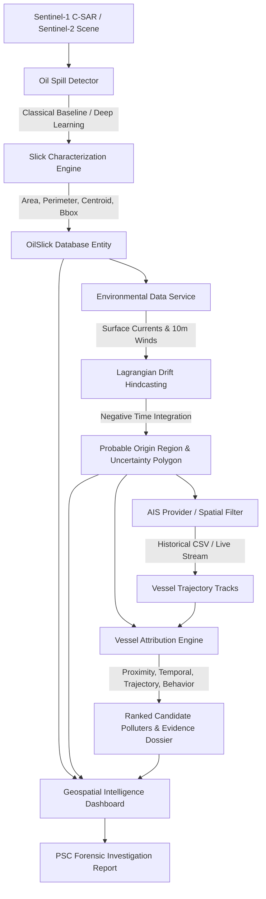

# MARINeX - Satellite Oil Spill Detection & AIS Vessel Attribution Platform

[](https://www.sih.gov.in/)
[](https://fastapi.tiangolo.com/)
[](https://vitejs.dev/)
[](https://www.docker.com/)
[](LICENSE)

> **Smart India Hackathon 2026 - Problem Statement SIH26143**  
> *"Leveraging satellite imagery to determine Oil spills at sea along with AIS data correlations to identify vessel responsible for the spill."*

---

## Project Status

Currently under active development for SIH 2026 (PS SIH26143). The production
UNet is frozen and calibrated, the incident-centric investigation pipeline
(evidence ledger, uncertainty, data quality, demo cases) is complete, and the
backend test suite passes (35 tests) with a clean frontend typecheck and build.
See [docs/CURRENT_STATE.md](docs/CURRENT_STATE.md) for the full status, known
limitations, and pending release items.

---

## 1. Problem Overview

Illegal operational oil discharges and accidental bunker spills in coastal and offshore shipping corridors cause severe ecological and economic damage. In the Indian Exclusive Economic Zone (EEZ), thousands of tankers and cargo vessels transit daily. Identifying delinquent polluters is challenging because:
- Satellite imagery captures oil slicks hours after the discharge occurred.
- Ocean surface currents and winds rapidly transport and disperse the slick far from its origin.
- Traditional AIS tracking yields hundreds of candidate ships along dense maritime lanes.
- Enforcement agencies (Indian Coast Guard, DG Shipping, Port State Control) require **defensible, explainable forensic evidence** before initiating vessel boardings or legal action.

**MARINeX** solves this with a coupled multi-stage pipeline:
1. **SAR Satellite Ingestion & Segmentation**: Detects dark radar backscatter suppression from capillary wave dampening.
2. **Morphometric Slick Characterization**: Computes surface area, perimeter, orientation, and compactness.
3. **Lagrangian Drift Hindcasting**: Backward-in-time advection and turbulent diffusion modeling using ocean currents and wind leeway forcing to reconstruct the **probable origin region and 95% uncertainty envelope**.
4. **AIS Corridor Correlation**: Filters and traces vessel trajectories in the spatio-temporal search window.
5. **Explainable Attribution Engine**: Computes 4 independent factor scores (Proximity, Temporal, Trajectory, Behavior) and outputs natural-language forensic audit evidence.
6. **Command Dashboard & Incident Dossier**: Geospatial visualization and automated Port State Control report generation.

---

## 2. Architecture Diagram



---

## 3. Monorepo Structure

```text
MARINeX/
├── backend/
│   ├── app/
│   │   ├── main.py                    # FastAPI application, CORS, lifespan & static mounting
│   │   ├── core/
│   │   │   ├── config.py              # Pydantic BaseSettings, paths, scoring weights
│   │   │   ├── database.py            # SQLAlchemy engine, session maker (SQLite / PostGIS)
│   │   │   └── logging.py             # Structured logger
│   │   ├── models/                    # Domain models: Scene, Slick, Environment, Drift, Vessel, Candidate, Investigation
│   │   ├── schemas/                   # Pydantic v2 validation schemas & GeoJSON types
│   │   ├── repositories/              # Clean DB data access layer
│   │   ├── services/
│   │   │   ├── detection/             # BaseOilSpillDetector, ClassicalBaselineDetector, MockDetector, Characterizer, Adapters
│   │   │   ├── environmental/         # EnvironmentalService (Winds, Currents, Waves)
│   │   │   ├── drift/                 # Lagrangian Monte Carlo drift hindcasting engine
│   │   │   ├── ais/                   # CSVAISProvider, MockAISProvider
│   │   │   ├── attribution/           # Explainable 4-factor scoring & evidence engine
│   │   │   └── reporting/             # Forensic investigation report generator
│   │   ├── api/v1/                    # REST API routes (scenes, detection, slicks, drift, ais, attribution, reports, demo)
│   │   └── utils/                     # Geospatial math (haversine, ellipsoidal area, convex hull) & image processing
│   ├── tests/                         # 35 unit & e2e integration tests (100% passing)
│   ├── requirements.txt
│   └── Dockerfile
├── frontend/                          # Geospatial dashboard (React 18, Vite, TypeScript, Leaflet, TailwindCSS) - incl. ML Intelligence, Explainability, Evidence Graph pages
├── data/
│   ├── samples/                       # Complete standardized sample datasets with documented contracts
│   └── README.md
├── ml/
│   ├── features/                      # Tabular feature extraction for look-alike discrimination
│   ├── evaluation/                    # IoU, Dice, Precision, Recall benchmarks
│   ├── data/                          # Manifests, leakage detection, dataset inventory
│   ├── data_audit/                    # Audit CLI (integrity + leakage fail-safe)
│   ├── ais/                           # AIS schema, trajectories, DuckDB/PostGIS engines
│   ├── explainability/                # Occlusion, GradCAM, decoder-feature attribution
│   ├── training/                      # Two-stage pipeline (stage-A seg + stage-B classifier)
│   ├── models/                        # U-Net, U-Net++, SegFormer, classifier, registry
│   ├── tests/                         # 19 unit tests (manifest, AIS, DuckDB, metrics, registry)
│   ├── train.py / evaluate.py / explain.py   # Config-driven CLI tools
│   └── requirements.txt               # Pin ML/data runtime deps
├── configs/
│   ├── datasets/                      # sentinel1_oilspill_{primary,external}.yaml descriptors
│   ├── training/                      # segformer.yaml, unet_plus_plus.yaml
│   └── environments/                  # local.yaml
├── scripts/
│   ├── seed_demo_data.py              # Populates database with Arabian Sea scenario
│   ├── run_pipeline_cli.py            # CLI tool to run end-to-end pipeline in terminal
│   ├── prepare_ais.py                 # AIS CSV -> partitioned parquet
│   ├── benchmark_ais.py               # DuckDB query benchmark -> reports/ais_benchmark.json
│   ├── smoke_two_stage.py             # Validates the two-stage pipeline end-to-end
│   ├── data_status.py                 # Manifest catalog table
│   └── setup_gpu.sh, prepare_data_remote.sh, train_remote.sh, evaluate_model.sh
├── docs/                              # Architecture, datasets, ML, explainability, AIS, remote training
├── docker-compose.yml                 # Multi-container setup (PostGIS + Backend + Frontend)
├── .env.example                       # Environment variables template
├── Makefile                           # Developer shortcut commands
└── README.md
```

---

## 4. Quickstart Guide

### Prerequisites
- Python 3.12+ (tested on Python 3.13)
- Node.js 18+ & npm
- Docker & Docker Compose (optional for local SQLite mode)

### Option A: Local Run (Zero-Setup SQLite Mode)

1. **Install Backend Dependencies**:
   ```bash
   pip install -r backend/requirements.txt
   ```

2. **Install ML/Data Dependencies** (into a virtualenv):
   ```bash
   python -m venv .venv
   .venv\Scripts\pip install -r ml/requirements.txt     # or: make install-ml
   ```

3. **Run the Test Suites**:
   ```bash
   python -m pytest backend/tests -v                     # backend (35 tests)
   .venv\Scripts\python -m pytest ml/tests -v            # ML + data (19 tests)
   ```

4. **Audit Datasets & Data Status**:
   ```bash
   .venv\Scripts\python -m ml.data_audit.audit_dataset --datasets p,e
   .venv\Scripts\python scripts/data_status.py
   ```

5. **Seed Demo Scenario & Verify CLI Pipeline**:
   ```bash
   python scripts/seed_demo_data.py
   python scripts/run_pipeline_cli.py
   ```

6. **Start Backend Server**:
   ```bash
   uvicorn app.main:app --app-dir backend --reload --port 8000
   ```
   API Docs available at: `http://localhost:8000/docs`

7. **Start Frontend Dashboard**:
   ```bash
   cd frontend
   npm install
   npm run dev
   ```
   Open `http://localhost:5173` in your browser.

---

### Option B: Docker Compose (PostGIS + Backend + Frontend)

Start the entire stack with one command:
```bash
docker compose up --build -d
```
- Frontend UI: `http://localhost:3000`
- Backend API & OpenAPI Docs: `http://localhost:8000/docs`
- PostGIS Database: `localhost:5432`

---

## 5. API Documentation

| Method | Endpoint | Description |
|---|---|---|
| `GET` | `/api/v1/health` | System health check and version metadata |
| `GET` | `/api/v1/scenes` | List ingested satellite scenes |
| `POST`| `/api/v1/scenes/upload` | Ingest or upload a new satellite scene |
| `POST`| `/api/v1/detection/run/{scene_id}` | Execute oil spill segmentation and characterization |
| `GET` | `/api/v1/slicks` | List detected oil slicks with bounding boxes |
| `GET` | `/api/v1/slicks/{id}/geojson` | Export slick as RFC 7946 GeoJSON Feature |
| `GET` | `/api/v1/environment/{slick_id}` | Retrieve wind and ocean current snapshot |
| `POST`| `/api/v1/drift/{slick_id}/simulate` | Run Lagrangian drift simulation / backward hindcast |
| `POST`| `/api/v1/ais/query` | Query vessels in spatial bbox and time window |
| `GET` | `/api/v1/ais/trajectories/{vessel_id}`| Retrieve vessel breadcrumb track |
| `POST`| `/api/v1/attribution/{slick_id}/run` | Execute explainable 4-factor vessel attribution |
| `GET` | `/api/v1/candidates/{slick_id}` | Retrieve ranked candidate polluters |
| `POST`| `/api/v1/reports/{slick_id}/generate` | Generate official PSC forensic investigation report |
| `GET` | `/api/v1/reports/{slick_id}/markdown` | Export investigation report as Markdown |
| `POST`| `/api/v1/demo/seed` | One-click demo seeder for Mumbai Offshore scenario |
| `POST`| `/api/v1/demo/run-e2e` | Execute the complete 8-stage pipeline end-to-end |

---

## 6. How Mock and Baseline Services Work

- **Detection**:
  - `ClassicalBaselineDetector`: Real adaptive Otsu thresholding + dark spot segmentation on SAR raster arrays. Clearly labeled as non-production baseline.
  - `MockOilSpillDetector`: Deterministic geo-referenced test polygon in the Arabian Sea (Mumbai Offshore shipping corridor).
  - `Adapters`: Future U-Net / SegFormer model slots.
- **Drift Simulation**:
  - `MockDriftService`: Real Lagrangian particle advection ($v_{\text{drift}} = v_{\text{current}} + 0.032 \cdot v_{\text{wind}}$) with stochastic turbulent diffusion ($D = 10 \text{ m}^2/\text{s}$). Computes genuine convex hull polygons for origin uncertainty.
- **AIS Provider**:
  - `CSVAISProvider`: Standardized CSV parser reading historical maritime position reports with real Haversine distance, bounding box, and temporal filtering.
  - `MockAISProvider`: Realistic synthetic corridor tracks for testing.
- **Attribution Engine**:
  - `VesselAttributionEngine`: 100% explainable weighted scoring:
    - **Proximity (35%)**: Closest Point of Approach (CPA) inverse distance.
    - **Temporal (25%)**: Consistency with inferred release window ($\sigma = 75$ min).
    - **Trajectory (25%)**: Geometric intersection with 95% uncertainty origin polygon.
    - **Behavior (15%)**: Vessel category prior risk (Tanker vs Tug) + speed anomaly detection.

---

## 7. ML & Data Infrastructure

The experimental layer is config-driven and environment-independent
(`DATA_ROOT`, `ARTIFACT_ROOT`, `SPLIT_PATH`, `MLFLOW_URI`). All datasets are
synthetic SAR-like patches; reports never claim real-data generalization.

```bash
# Training & evaluation (writes models/best_model/, reports/)
.venv\Scripts\python ml/train.py --config configs/training/unet_plus_plus.yaml
.venv\Scripts\python ml/evaluate.py --checkpoint models/checkpoints/unetpp_best.pt --model unet_plus_plus --threshold 0.40

# Explainability panel (SegFormer, all 3 methods)
.venv\Scripts\python ml/explain.py --checkpoint models/checkpoints/segformer_primary_best.pt --model segformer \
  --image data/datasets/sentinel1_primary/images/patch_0101.png --mask data/datasets/sentinel1_primary/masks/patch_0101.png \
  --methods occlusion,gradcam,attention --out reports/explainability/patch_0101_panel.png

# AIS pipeline (sample -> partitioned parquet -> queries)
.venv\Scripts\python scripts/prepare_ais.py --input data/samples/sample_ais_trajectories.csv --output data/processed/ais/partitions \
  --region 71.0 71.7 19.0 19.6 --start 2026-03-01T00:00:00Z --end 2026-03-02T00:00:00Z
.venv\Scripts\python scripts/benchmark_ais.py   # -> reports/ais_benchmark.json
```

Best measured test IoU: **U-Net++ 0.9215** (fresh `ml/evaluate.py` run). The
historical broken Two-Stage `0.0000` was repaired (percentile-preprocessing
invariant + crop-consistent classifier training); repaired IoU **0.8379**.
See `docs/ML.md` for full tables and `docs/{DATASETS,DATA_ARCHITECTURE,ML_EXPLAINABILITY,AIS_PIPELINE,REMOTE_TRAINING}.md`.

## Scientific Validation

The production model **marinex-unet-v1.0.0** (frozen UNet, percentile
preprocessing, channels `[VV, VH, VV-VH]`, threshold 0.70, temperature 0.2262)
is backed by a documented validation campaign. Key verified results:

- **Frozen test metrics**: IoU 0.8857, Dice 0.9394, Precision 0.9080,
  Recall 0.9731, FPR 0.0041, object-F1 0.7901.
- **Calibration**: ECE 0.1735 -> 0.0046 and Brier 0.0330 -> 0.0025 via log-space
  temperature scaling.
- **Multi-seed stability**: seeds 42/123/999 -> val IoU 0.9459 / 0.9358 / 0.9265.
- **Robustness**: stable under mild contrast/radiometric stress; fails under
  enhanced speckle (IoU 0.4424) and +3 dB radiometric shift (IoU 0.3030) -
  mirrored by the low-confidence demo-gate behavior.
- **Cross-dataset**: in-domain Arabian Sea 0.8857 IoU; external Singapore Strait
  0.8487 IoU / 0.9181 Dice.
- **Scene-level**: SCENE_02 0.9034, SCENE_11 0.8743 (mean 0.8889); slick-size
  quartiles 0.9355-0.9678.
- **Look-alikes**: OIL 0.9583, LOOKALIKE 0.8145, CLEAN 0.0; rejection rate 0.30,
  clean false-detection 0.0.
- **Drift**: physics sanity ALL PASS, deterministic, 15 sensitivity scenarios.
- **AIS**: audit clean (0 duplicates, 0 large jumps), trajectory validation ALL
  PASS (~0.1% error).
- **Explainability**: perturbation test PASS (conf drop ~0.055); randomization
  test WEAK - attribution maps must not be over-interpreted.

Full artifacts live under `reports/` (see
[docs/QUALITY_GATE.md](docs/QUALITY_GATE.md) for the complete checklist and
artifact map).

## 8. Future ML Roadmap

1. **Phase 1 (Complete)**: Classical image processing baseline + explainable 4-factor scoring engine.
2. **Phase 2 (Complete)**: Deep learning semantic segmentation with **U-Net / U-Net++ / SegFormer** trained on Sentinel-1 SAR imagery.
3. **Phase 3 (Complete)**: Look-alike discrimination (two-stage SegFormer + crop classifier, repaired and validated).
4. **Phase 4**: Operational integration with **OpenDrift / OpenOil** for full 3D weathering and wave Stokes drift.
5. **Phase 5**: Real-time AIS streaming integration via **AISHub** and **Coast Guard VTS**.
6. **Phase 6**: Learned graph-neural vessel attribution model calibrated against historical Maritime Coast Guard incident records.
7. **Phase 7**: Statistical uncertainty calibration (Conformal Prediction).
8. **Phase 8**: Multi-satellite fusion (SAR + Optical Sentinel-2 + Thermal Landsat-9).
9. **Phase 9**: Wire real checkpoints + attribution maps into the backend detection service (currently classical/mock).

---

## 9. License & Attribution
Developed for Smart India Hackathon 2026 under Problem Statement SIH26143.
Licensed under the MIT License.
