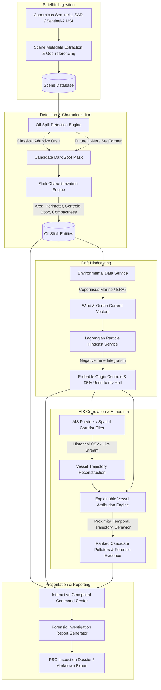

# MARINeX System Architecture (SIH26143)

MARINeX is a modular geospatial intelligence platform designed for **Smart India Hackathon 2026 Problem SIH26143**:
*"Leveraging satellite imagery to determine Oil spills at sea along with AIS data correlations to identify vessel responsible for the spill."*

---

## 1. End-to-End Pipeline Architecture

---

## 2. Core Domain Components

### A. ML Detection Service (`app/services/detection/`)
- **`BaseOilSpillDetector`**: Abstract interface defining `predict()`, `segment()`, `confidence()`, and `metadata()`.
- **`ClassicalBaselineDetector`**: Explainable baseline using adaptive Otsu thresholding on SAR normalized radar cross section ($\sigma^0$), morphological opening/closing to filter ocean speckle noise, and contrast measurement in dB.
- **`MockOilSpillDetector`**: Deterministic synthetic polygon generator for integration tests.
- **`Adapters`**: Plug-and-play adapter classes for PyTorch U-Net, DeepLabV3+, and SegFormer models.

### B. Slick Characterization Engine (`app/services/detection/characterizer.py`)
Calculates physical morphometrics from binary masks and polygons:
- **Geodesic Area ($km^2$)**: Scaled metric integration across WGS-84 ellipsoidal coordinates.
- **Perimeter ($km$)**: Great-circle boundary length.
- **Centroid**: Center of mass in `[longitude, latitude]`.
- **Oriented Minimum Bounding Box**: Calculates length of major axis, width of minor axis, and orientation angle.
- **Compactness**: Isoperimetric circularity quotient $4 \pi \cdot \text{Area} / \text{Perimeter}^2$.

### C. Drift Simulation & Hindcasting (`app/services/drift/`)
- Integrates net surface velocity:
  $$\vec{v}_{\text{net}} = \vec{v}_{\text{current}} + \alpha \cdot \vec{v}_{\text{wind}}$$
  where $\alpha \approx 0.032$ (leeway wind drift factor).
- Backward integration with stochastic Gaussian turbulent diffusion:
  $$\Delta x_{\text{diff}} = R_x \sqrt{2 D \Delta t}, \quad \Delta y_{\text{diff}} = R_y \sqrt{2 D \Delta t}$$
- Computes convex hull around dispersed particle cloud at $t_{\text{origin}}$ to represent the **95% Probable Origin Region**.

### D. AIS Provider & Spatio-Temporal Filter (`app/services/ais/`)
- Standardized `AISProvider` interface.
- `CSVAISProvider`: Efficient spatial bounding box and temporal window filtering with trajectory interpolation.
- `MockAISProvider`: Realistic synthetic maritime corridor traffic generator.

### E. Vessel Attribution Engine (`app/services/attribution/`)
Computes four independent, explainable factor scores:
1. **Proximity Score ($S_{\text{prox}}$)**: Exponential decay from origin centroid at Closest Point of Approach (CPA).
2. **Temporal Score ($S_{\text{temp}}$)**: Gaussian consistency with hindcast origin release time ($\sigma = 75$ min).
3. **Trajectory Score ($S_{\text{traj}}$)**: Direct geometric intersection with origin uncertainty polygon.
4. **Behavior Score ($S_{\text{behav}}$)**: Cargo risk classification (Crude Tanker vs Tug) and transit speed anomalies.

Composite Candidate Score:
$$S_{\text{overall}} = w_{\text{prox}} S_{\text{prox}} + w_{\text{temp}} S_{\text{temp}} + w_{\text{traj}} S_{\text{traj}} + w_{\text{behav}} S_{\text{behav}}$$
All scores are accompanied by audit-trail natural language forensic evidence points.

---

## 3. Incident-Centric Investigation Layer

The platform is organized around **incidents**, not isolated slicks:

- **Incident** (`Incident` model): an investigation record with lifecycle status
  (`DETECTED` → `UNDER_INVESTIGATION` → ... ). A scene is attached via
  `POST /incidents/{id}/scenes`; detection runs on it with an
  `incident_id` scope.
- **Evidence ledger** (`EvidenceRecord`): append-only facts with a
  `StatusLabel` (OBSERVED / ML_SEGMENTED / INFERRED / SIMULATED / TRACKED /
  CANDIDATE / DEMO_DATA) and a JSON `provenance` object. Every metric, drift
  forecast, attribution factor, and map artifact lands here — nothing is
  claimed without a labeled source.
- **Aggregates** (scoped to the incident's primary slick): `drift-reports`,
  `attribution` (top-N ranked vessels with per-factor scores nested under
  `c.factors`), `origin` (latest HINDCAST hull, `INFERRED`), and `report`
  (consolidated Markdown/summary).
- **Async jobs** (`jobs` router): POST to create, POST `/{id}/run` to execute
  a stage (detection / drift / attribution / environment / report) in a
  background thread with its own engine + DB session (`get_engine_url()`);
  poll via GET for status + artifacts.

## 4. ML Campaign & Interpretability (post-training production services)

- **Model**: PyTorch U-Net FINAL (IoU=0.8857 / Dice=0.9394 on frozen test),
  probability maps calibrated via log-space temperature scaling
  (ECE 17.35 % → 0.46 %, T=0.226). Production threshold 0.70.
- **Adapters** apply the identical preprocessing contract
  (`SARPreprocessor(strategy="percentile")`, channel axis `[VV, VH, DIFF]`);
  single-band inputs are replicated and flagged via `channel_note`.
- **Explainability service**: occlusion perturbation + Grad-CAM heatmaps with
  provenance JSON (`reports/explainability/EXP-*`), exposed as
  `POST /explainability/run`.
- **Deterministic science**: drift hindcast/forecast and vessel attribution
  remain closed-form, interpretable physics/geometry — the ML layer only
  produces the slick mask and calibrated confidence.
